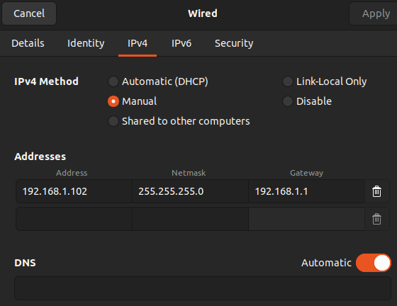
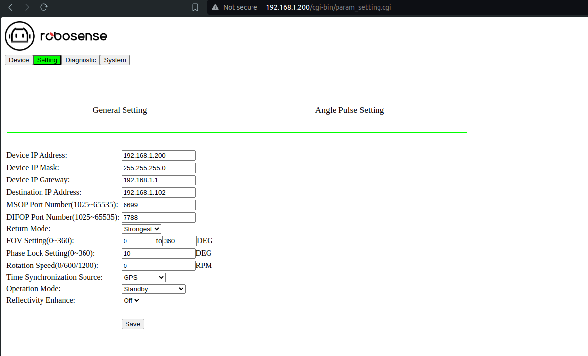

# Connection to LiDAR

Connecting the LiDAR via ethernet:

1. Configuraing the network 
2. Opening the GUI 

Be sure to:

- be attentive to the temperature at all times (under Diagnostic)
- use the operation mode to control the action of the LiDAR